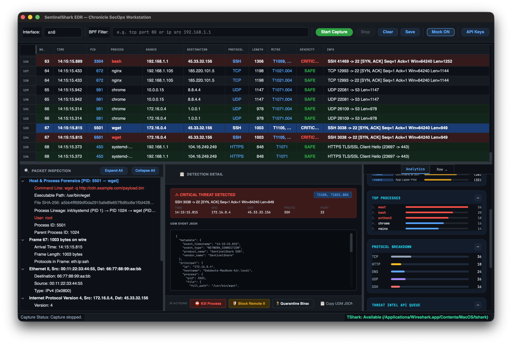

# SentinelShark
> **Modern Desktop Network Intrusion Detection & Analysis System (NIDS)**

SentinelShark is a high-performance, modern Wireshark clone built with **Python 3.10+**, **PyQt6**, **PyShark**, and `httpx`. Tested and verified on both **macOS** and **Windows**, it dissects live network packets in real time and enriches public IP traffic with real-time threat intelligence and geolocation data from **VirusTotal**, **AbuseIPDB**, and **IPinfo**.



---

## Key Features

- **Cross-Platform Compatibility**: Fully tested, optimized, and verified on **macOS** and **Windows 10/11**.
- **Live Sniffing & PCAP / PCAPNG Import & Export**:
  - Sniff live interface traffic using line-buffered TShark subprocess streaming.
  - Export packet captures to standard `.pcap` and `.pcapng` files (100% native Wireshark compatibility).
  - Open `.pcap` / `.pcapng` files with an interactive **Threat Analysis Prompt** ("Do you want to analyze this file?").
- **Graceful Fallback & Mock Generator**: Built-in high-fidelity Mock Traffic Generator ensures SentinelShark functions out-of-the-box even when `tshark` is not installed on the host machine.
- **Threat Intelligence & Geolocation Enrichment**:
  - **IPinfo Integration**: Queries and displays complete IP details (hostname, organization, ASN, city, region, country, coordinates, timezone, postal code, anycast flags, privacy indicators, etc.).
  - **AbuseIPDB Integration**: Queries Abuse Confidence Scores, total report counts, and country codes.
  - **VirusTotal Integration**: Queries IP malicious, suspicious, and harmless engine detection counts.
- **Smart BPF & Real-Time Search Filtering**:
  - **BPF Sanitizer**: Translates user-friendly shortcuts (`http`, `dns`, `https`, `ssh`, `8.8.8.8`) into valid BPF syntax for TShark while gracefully handling syntax errors.
  - **Live Table Filter**: Instantly filters packet rows as you type in the search bar.
- **Smart Non-Routable IP Filtering**: Automatically skips RFC 1918 private IP ranges (`10.0.0.0/8`, `172.16.0.0/12`, `192.168.0.0/16`), loopback, link-local, and multicast addresses to conserve API limits.
- **In-Memory TTL Caching**: High-performance in-memory TTL cache with configurable TTL (24-hour default) and fast LRU eviction, avoiding disk database overhead.
- **Rate Limiting & Exponential Backoff**: Async background queue manager handles rate-limiting and automatically performs exponential backoff on HTTP 429 errors.
- **High-Performance PyQt6 UI**:
  - **Packet Table**: Color-coded rows highlighting public IPs (Red = Critical Threat, Amber/Orange = Medium Risk, Green = Safe Public IP).
  - **Packet Inspector**: Interactive collapsible tree breaking down Ethernet, IP, TCP/UDP, DNS, HTTP, and TLS layers alongside exhaustive Threat Intel and IPinfo geolocation details.
  - **Hex Dump Inspector**: Dual Hex & ASCII byte viewer with payload MD5 & SHA256 hashing.
  - **NIDS Dashboard**: Live packet counts, data throughput metrics, protocol breakdown, and real-time API queue progress.

---

## Repository Structure

```
sentinelshark/
├── README.md                  # Complete documentation
├── requirements.txt           # Dependency manifest
├── config.json.example        # Configuration template
├── run.py                     # Root execution entrypoint
├── tests/
│   └── test_sentinelshark.py  # Unit test suite
└── app/
    ├── __init__.py
    ├── main.py                # PyQt6 + qasync event loop launcher (Windows/macOS compatible)
    ├── config.py              # Configuration & API Key manager
    ├── core/
    │   ├── capture.py         # TShark subprocess & Mock capture worker thread (QThread)
    │   ├── parser.py          # Protocol dissector & Hex/ASCII formatter
    │   ├── pcapwriter.py      # Native binary PCAP / PCAPNG file exporter
    │   └── cache.py           # In-memory TTL threat cache manager
    ├── services/
    │   ├── threatintel.py     # Async AbuseIPDB, VirusTotal & IPinfo httpx client
    │   └── queuemanager.py    # Prioritized lookup queue & rate limiter
    └── ui/
        ├── mainwindow.py      # Main application window, menu shortcuts & toolbar
        ├── styles.py          # Modern dark-mode QSS stylesheet
        └── components/
            ├── packettable.py # Color-coded packet list widget
            ├── packetdetail.py# Interactive layer dissection tree & IPinfo inspector
            ├── hexview.py     # Hex & ASCII byte inspector
            └── statspanel.py  # Live stats dashboard
```

---

## Quick Start

### 1. Prerequisites
- Python 3.10+
- (Optional) `tshark` / `Wireshark` (Npcap on Windows) installed for live sniffing on host interfaces. If `tshark` is missing, SentinelShark automatically switches to **Mock Mode**.

### 2. Installation
```bash
# Clone repository
git clone https://github.com/DebdootManna/sentinelshark.git
cd sentinelshark

# Create virtual environment
python3 -m venv venv
source venv/bin/activate  # On Windows: venv\Scripts\activate

# Install dependencies
pip install -r requirements.txt
```

### 3. Running the Application

```bash
# Standard Execution (Sniffs live interface or falls back to Mock Mode)
python run.py

# Elevated Execution on macOS (Required for raw /dev/bpf live interface sniffing)
sudo ./venv/bin/python run.py
```

---

## PCAP & PCAPNG File Capabilities

- **Saving Captures**: Navigate to **File -> Save Capture As...** (`Ctrl+S` / `Cmd+S`) or click **Save Capture** on the toolbar. Saves raw packet payloads to standard `.pcap` or `.pcapng` files (100% compatible with Wireshark and TShark).
- **Opening Captures**: Navigate to **File -> Open PCAP File...** (`Ctrl+O` / `Cmd+O`).
  - Displays a prompt: *"This file has not been analyzed. Do you want to analyze it?"*
  - **Yes**: Analyzes public IP traffic with AbuseIPDB, VirusTotal, and IPinfo threat intelligence.
  - **No**: Loads the capture without API threat lookups, leaving threat intel inspector sections un-analyzed.

---

## Threat Intelligence API Configuration

You can configure API keys via environment variables or inside the GUI:

1. **Environment Variables**:
   ```bash
   export ABUSEIPDB_API_KEY="your_abuseipdb_key"
   export VIRUSTOTAL_API_KEY="your_virustotal_key"
   export IPINFO_API_KEY="your_ipinfo_key"
   ```
2. **GUI Settings Modal**:
   - Click **API Keys** on the toolbar or navigate to **Settings -> API Credentials...**
   - Enter your AbuseIPDB, VirusTotal, and IPinfo API keys and click **OK**. Settings automatically save to `.env`.

---

## Running Unit Tests

Run the test suite to verify core components, IP filtering, BPF sanitization, in-memory TTL caching, PCAP exporter, and packet dissector logic:
```bash
python -m unittest discover tests
```

---

## Design & Aesthetics
SentinelShark features a sleek cyber dark mode (`#0f172a`, `#1e293b`) with neon cyan accents (`#06b6d4`), emerald safe indicators (`#10b981`), amber risk warnings (`#f59e0b`), and crimson threat highlights (`#ef4444`).
